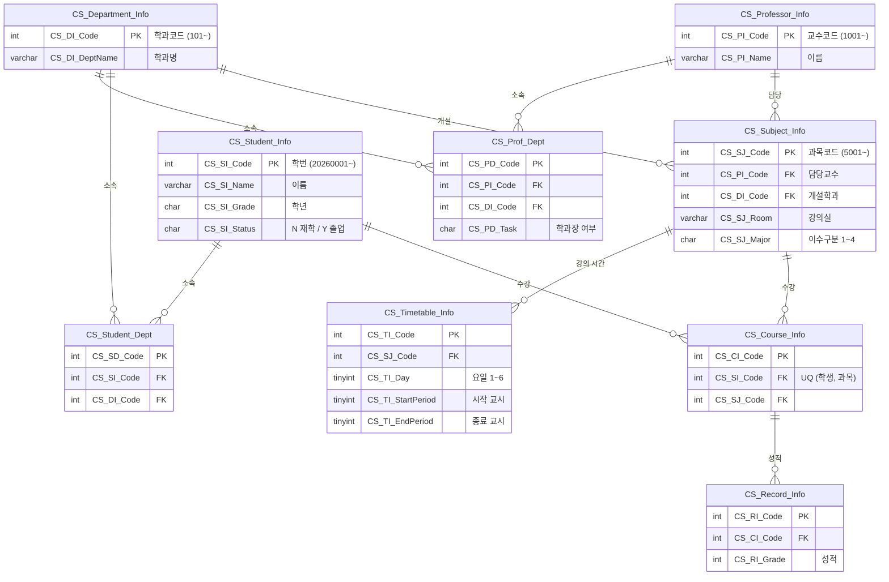

# 학사관리 시스템 (College System)

> Spring Boot · JPA · SQL Server로 만든 학사관리 웹 서비스입니다. 학과·교수·학생·과목을 등록하고, **수강 신청**과 **성적 입력**, 그리고 강의실·담당교수·수강 과목 간 **시간 충돌을 검사하는 시간표** 기능을 제공합니다.

## 주요 기능

| 기능 | 내용 |
| --- | --- |
| **기본 정보 관리** | 학과 · 교수 · 학생 · 과목 등록과 목록 조회 |
| **소속 관리** | 교수 소속학과(학과장 여부 포함), 학생 소속학과 등록 |
| **수강 신청** | 같은 과목 중복 신청 차단, 이미 수강 중인 과목과 **강의 시간이 겹치면 신청 불가** |
| **성적 입력** | 수강 정보별 성적 입력, 입력 일자 자동 기록 |
| **강의 시간 등록** | 요일(월\~토) · 교시(1\~12) 지정, **같은 과목 · 같은 강의실 · 같은 담당교수**의 시간 충돌 검사 |
| **학생별 시간표** | 학생을 선택하면 수강 과목의 강의 시간을 요일 × 교시 표로 표시 |
| **DB 연결 확인** | 서버 시작 시 DB 연결 테스트, `/health/db`로 상태 확인 |

## 기술 스택

| 구분 | 사용 기술 |
| --- | --- |
| Backend | Java 17, Spring Boot 4.1, Spring Data JPA |
| Frontend | Thymeleaf, HTML, CSS |
| Database | Microsoft SQL Server 2022 Express |
| Build | Maven |

## DB 설계



**설계 포인트**

- **코드는 DB 시퀀스로 자동 부여**합니다. 학번은 `20260001`, 교수는 `1001`, 과목은 `5001`, 학과는 `101`부터 시작해 코드만 보고도 종류를 알 수 있습니다. JPA의 `@SequenceGenerator`가 같은 시퀀스를 사용합니다.
- **시간표는 과목 단위로 저장**합니다. 학생 시간표는 수강정보와 조인해서 만들기 때문에, 과목 시간이 바뀌어도 학생별 데이터를 고칠 필요가 없습니다.
- **충돌은 DB와 코드 두 단계에서 막습니다.**
  - DB: 수강정보 `UNIQUE(학생, 과목)`, 시간표 `UNIQUE(과목, 요일, 시작 교시)`, 요일·교시 범위 `CHECK`
  - 코드: 교시 구간이 겹치는지 검사해 강의실·담당교수·학생 수강 시간 충돌을 막음
- **학생 연락처(주소·전화번호·이메일)만 NULL 허용**하고 나머지는 필수 값으로 둡니다. 폼의 빈 칸은 빈 문자열이 아니라 `NULL`로 저장되도록 공통 처리(`FormBindingAdvice`)했습니다.

전체 컬럼과 제약 조건은 [`db/schema.sql`](db/schema.sql)에 있습니다.

## 프로젝트 구조

```
├── db
│   ├── schema.sql              # 전체 테이블 생성 스크립트 (최종 구조)
│   ├── fk_notnull.sql          # 변경 이력: FK 추가, NULL 허용 정리
│   └── timetable_redesign.sql  # 변경 이력: 시간표를 과목 단위로 재설계
└── src/main
    ├── java/com/chan/demo
    │   ├── config        # DB 연결 확인, 폼 입력 공통 처리
    │   ├── controller    # 학생·교수·학과·과목·수강·성적·시간표 등
    │   ├── entity        # JPA 엔티티 9개
    │   └── repository    # Spring Data JPA 리포지토리
    └── resources
        ├── application.properties.example   # DB 접속 설정 템플릿
        └── templates                        # 등록 폼 · 목록 · 완료 화면
```

## 실행 방법

### 1. DB 준비

SSMS에서 `db/schema.sql`을 실행합니다. `College_System` 데이터베이스가 없으면 함께 만들어집니다.

> `fk_notnull.sql`, `timetable_redesign.sql`은 기존 DB를 고칠 때 썼던 변경 이력입니다. 새로 만들 때는 `schema.sql`만 실행하면 됩니다.

### 2. 접속 설정

`application.properties.example`을 복사해 `application.properties`를 만들고 DB 주소·계정·비밀번호를 입력합니다.

```bash
cp src/main/resources/application.properties.example src/main/resources/application.properties
```

> `application.properties`는 비밀번호가 들어 있어 `.gitignore`로 제외되어 있습니다.

### 3. 실행

```bash
./mvnw spring-boot:run
```

Windows에서는 `mvnw.cmd spring-boot:run`을 실행합니다.

| 화면 | 주소 |
| --- | --- |
| 메인 (전체 메뉴) | http://localhost:8080 |
| 학생 · 교수 · 학과 · 과목 목록 | `/students`, `/professors`, `/departments`, `/subjects` |
| 수강 신청 · 성적 입력 | `/courses/new`, `/records/new` |
| 강의 시간 등록 | `/timetables/new` |
| 학생별 시간표 | `/timetables/student` |
| DB 연결 확인 | `/health/db` |
